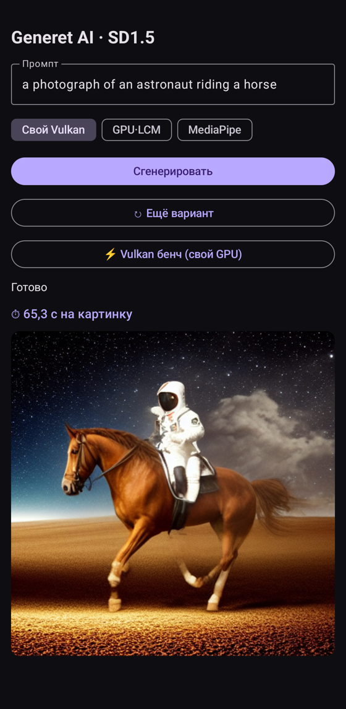
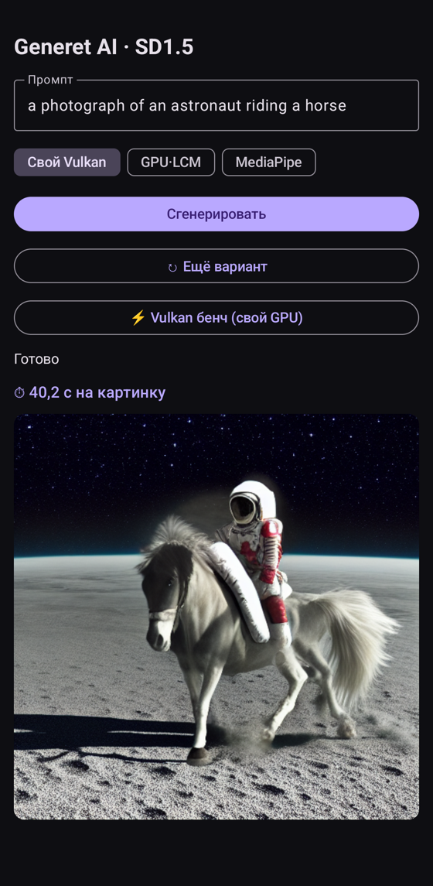
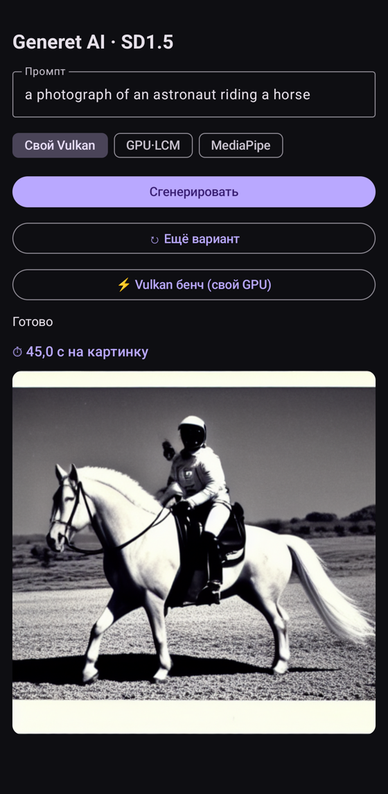
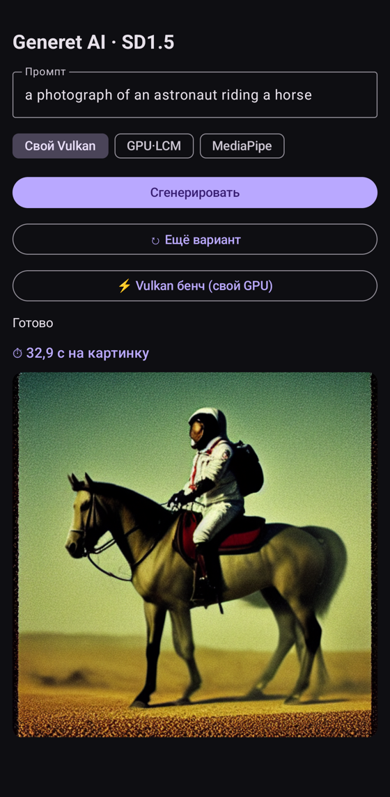
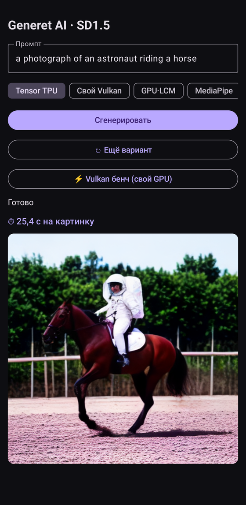

# Generet AI — Stable Diffusion 1.5 на собственном Vulkan-движке

Локальная генерация изображений на телефоне **без облака и без вендорского NPU-рантайма** —
весь UNet считается **собственным Vulkan compute-движком**, написанным с нуля под конкретный GPU.

Тестовое устройство — **Pixel 10 Pro (Google Tensor G5)**. Это первый Pixel на GPU
**Imagination PowerVR DXT-48-1536**: рынок (Local Dream, Off Grid) ускоряется через Qualcomm
Hexagon/QNN NPU и на Tensor падает в фолбэк — под PowerVR DXT свои SD-движки никто не писал.

> **Ветки:** `master` — FP32-эталон (corr 0.0003, для сверки точности). `fp16` — **быстрый движок**
> (warm 32.9 с, −18 %, качество 0.0024) — рекомендуется для использования. Документация (этот README)
> ведётся только на `master`. Подробности обеих версий — ниже.

Вторым бэкендом в приложение добавлен **Tensor TPU** (UNet на NPU через LiteRT, 31.9 с) — он нужен
как точка отсчёта: показывает, что даёт вендорское матричное железо там, где своих ядер написать
нельзя. Свой Vulkan-движок остаётся основной частью проекта. Подробности — [ниже](#tpu-google-tensor-g5--второй-бэкенд-для-сравнения).

## Результат

Промпт: *"a photograph of an astronaut riding a horse"*, SD1.5, 4 шага LCM, CFG, 512×512.
Одна и та же картинка, разница — во времени: первый запуск грузит веса с диска
(~1.6 ГБ fp16, FP32-движок разворачивает их в ~3.2 ГБ fp32 в VRAM), последующие держат их в памяти.

| Холодный старт (с загрузкой весов) | Тёплый старт (веса в памяти) |
|:---:|:---:|
|  |  |
| **⏱ 65.3 с** | **⏱ 40.2 с** |

Картинка целиком сгенерирована своим движком: CLIP/VAE — через LiteRT, **весь denoise (UNet) —
наш Vulkan**. Численная корректность forward против эталона PyTorch: **relErr 0.0003** (fp32).

---

## FP16-движок (ветка `fp16`) — быстрее без потери качества

Весь граф переведён в **fp16-хранение + fp32-аккумуляция** (как tensor cores), плюс **packed-f16
арифметика в attention** (score-dot в `f16vec4`). Веса SD на диске и так fp16 → перевод бесплатен
по качеству; ускоряется загрузка и вычисления. Та же картинка, то же качество — быстрее:

| Холодный старт (fp16) | Тёплый старт (fp16) |
|:---:|:---:|
|  |  |
| **⏱ 45.0 с** | **⏱ 32.9 с** |

| Режим | FP32 | **FP16** | Выигрыш |
|---|---|---|---|
| **Тёплая генерация** | 40.2 с | **32.9 с** | **−18 %** |
| **Холодная генерация** | 65.3 с | **45.0 с** | **−31 %** |
| VRAM весов | ~3.2 ГБ (fp32) | **~1.6 ГБ (fp16)** | **−50 %** |
| Корректность (self-test) | relErr 0.0003 | **0.0024** | визуально идентично |

### Что дало ускорение (и что проверено-отклонено)
| Приём | Итог |
|---|---|
| full-fp16 граф (хранение) | warm 40→34.5 с ✅ |
| **packed-f16 attention** (score-dot в f16) | ATTN −17 %, ATTN_BIG −26 % → 34.5→32.9 с ✅ |
| packed-f16 **matmul** | ±5 % (matmul memory-bound, не ALU-bound) ❌ |
| больший рег-тайл 8×16 / BK=8 в fp16 | хуже (occupancy: меньше варпов) ❌ |
| packed-f16 V-аккумуляция в attention | corr ×5.5 за ~1 % → откат ❌ |

Вывод по железу: matmul упирается в **shared-bandwidth + occupancy** PowerVR (packed-арифметика
не помогает — узкое место не ALU); attention compute-bound (там packed-f16 дал реальный выигрыш).
f16-ALU PowerVR ≈ 1.34× fp32 (не 2×). Дальнейшие рычаги — уже **не fp16** (алгоритмика / TPU).

---

## TPU (Google Tensor G5) — второй бэкенд для сравнения

Пункт дорожной карты «вынести UNet на матричное железо» закрыт: в приложении есть переключатель
**Tensor TPU**, весь UNet считается на EdgeTPU через LiteRT, CLIP остаётся на CPU, декодер — на GPU.

<div align="center">

| Результат на TPU |
|:---:|
|  |
| **⏱ 31.9 с** (forward 4.9 с × 6) |

</div>

**Своего движка под TPU быть не может.** У Tensor нет публичного ISA и аналога SPIR-V: наружу
отдана только подача готового графа `.tflite`, ядра пишет закрытый компилятор Google. Поэтому роль
меняется с «пишу ядра под железо» на «готовлю граф под компилятор» — прямая противоположность
Vulkan-части проекта. Доступ — через **Google Tensor ML SDK Beta**: AOT-компиляция под
`SocModel.TENSOR_G5`, запуск через LiteRT-Next C-API.

Что получилось на практике:

| | |
|---|---|
| Покрытие графа | **3328/3328 операций на NPU**, ноль fallback на CPU |
| Точность forward | **corr 0.999996** (relErr 0.0029) против fp32-эталона |
| Формат | только **bfloat16**: fp16-усечение даёт NaN на всех 16384 выходах (узкий экспонент) |
| Время forward | **4.95 с** |

### Сравнение бэкендов на одном устройстве (один forward UNet)

| Бэкенд | Время | Примечание |
|---|---|---|
| **TPU (bf16)** | **4.95 с** | весь граф на NPU |
| Свой Vulkan (fp32) | ~9 с | рукописные SPIR-V-ядра |
| CPU (XNNPACK) | ~10.5 с | 8 потоков |
| LiteRT GPU-делегат | ~25 с | на GPU ушло лишь 175 из 3610 узлов (GATHER_ND и др. не поддержаны) |

### Грабли, которые пришлось обойти

- **EdgeTPU не пускает приложение**: `com.example... is not in the EdgeTPU allowed list` — доступ к NPU
  выдаётся Google по allowlist. Обход без root и без обращения в Google: UNet считает маленький
  shell-демон (`tools/npu/litert_tpu_daemon.c`, uid shell разрешён), приложение общается с ним по
  **TCP на 127.0.0.1**. Файловый IPC не годится — sdcardfs даёт EACCES в обе стороны.
- **Компилятор AOT падает с `INTERNAL` на свежем хосте** (glibc 2.43): собирается в Docker
  `ubuntu:22.04` — `tools/Dockerfile.aot` + `tools/docker_compile.py`.
- **batch-CFG B=2 недоступен — и это чужой баг, а не предел железа.** Считать cond и uncond одним
  проходом (батч 2) — прямой способ вдвое сократить число запусков UNet, в Vulkan-движке он работает.
  Модель с B=2 компилируется полностью (3328/3328), но рантайм edgetpu падает на фатальном
  `CHECK failed: pending_sink_fds.erase(fd) > 0 (0 vs. 0) Unexpected fd from epoll: 0` —
  на графе с двумя выходами. Проверено, что дело не в нашем окружении: одинаково воспроизводится
  под `nohup`, с `< /dev/null` и в переднем плане, то есть это не файловые дескрипторы демона и не
  отвязка процесса, а асинхронный диспетчер закрытого рантайма — чинить нечем.
  После отказа от CFG на поздних шагах запусков стало 6 вместо 8, поэтому рабочий B=2 дал бы
  теперь не двукратную экономию, а 6 → 4 запуска.

### int8: проверено и отклонено

Квантизация — единственный способ пробить 4.95 с на этой UNet. Проверены шесть вариантов
(`tools/quantize_int8.py`, `tools/quantize_wo8.py`), все замеры — на устройстве:

| Вариант | forward | corr | Итог |
|---|---|---|---|
| bf16 (эталон) | 4.95 с | 0.999996 | ✅ используется |
| W8A8, min/max | 3.15 с | 0.889 | быстро, картинка разваливается ❌ |
| W8A8, OCTAV (symmetric) | 3.53 с | 0.858 | симметрия теряет полшкалы ❌ |
| W8A8 + MUL/SUB во float | 3.21 с | 0.988 | **31.1 с на картинку, но цветной мусор** ❌ |
| MSE (квантует лишь conv/fc) | 4.83 с | 0.9987 | качество есть, ускорения нет ❌ |
| weight-only int8 | 5.19 с | 0.99999 | TPU разворачивает веса обратно ❌ |
| W8A16 | — | — | int16-активации edgetpu не поддерживает ❌ |

Главный вывод: **corr одного forward обманчив**. В диффузии выход шага идёт на вход следующему,
и за 4 шага LCM ошибка 21 % со сжатием динамики (std 0.83 против 0.99) разрушает изображение —
хотя corr 0.988 выглядит приличным. Планка для 4-шагового LCM — **corr ≈ 0.999+**, а он достижим
только когда основная часть графа остаётся во float, то есть без ускорения.
Отдельно: качество рушит поэлементный **MUL** в GroupNorm (619 узлов), а не softmax/attention.

### Что реально ускорило (без потери качества)

| Приём | Итог |
|---|---|
| **CFG только на первых 2 шагах из 4** | 8 forward → 6: 44.5 → 34.4 с ✅ |
| **TAESD вместо полного VAE** (5 МБ против 95 МБ) | декод 4 с → 1 с: 34.4 → **31.9 с** ✅ |
| полный отказ от CFG | 24.6 с, но астронавт вырождается в жокея — теряется следование промпту ❌ |

Замеры сделаны при одном `seed`, иначе сравнивать картинки нельзя. Число шагов с CFG задаётся
файлом `models/cfg_steps.txt` без пересборки.

> Инструменты экспорта, квантизации и замеров — в [`tools/`](tools/), описание — [`tools/README.md`](tools/README.md).
> Бинарники Google SDK (`libLiteRt*.so`, заголовки, `libLiteRtDispatch_GoogleTensor.so`) в репозиторий
> не входят — их выдаёт Google вместе с Tensor ML SDK.

---

## Метрики (Tensor G5 / PowerVR DXT-48, FP32)

### Время генерации (512×512, 4 шага LCM, batch-CFG)

| Режим | Время | Примечание |
|---|---|---|
| Тёплый (веса в памяти) | **~40 с** | ~9 с/шаг, один batched forward B=2 (cond+uncond вместе) |
| Холодный (с загрузкой весов) | ~65 с | +~24 с: чтение 1.6 ГБ fp16 с диска + разворот в 3.2 ГБ fp32 |
| Корректность forward (B=1) | relErr **0.0003** | vs PyTorch-эталон |
| Корректность batch-CFG (B=2) | img0/img1 **0.0003** | оба изображения совпадают с эталоном |

### Профиль forward по категориям операций (B=1)

| Операция | Доля | n | Комментарий |
|---|---:|---:|---|
| **MM** (matmul) | 50.8 % | 258 | главная стоимость |
| **ATTN** (flash, d≤40) | 14.4 % | 10 | self-attention |
| **WIN_MM64 + MM_WINO** | 11.0 % | 24 | матмулы Winograd-свёрток |
| **ATTN_BIG** (d>40) | 7.4 % | 22 | |
| LN / AB / ADD / GN / прочее | ~16 % | — | layernorm, bias, residual, groupnorm |

Матмул-семейство ≈ **62 %** времени → главная цель оптимизации.

### Пропускная способность ядер (GFLOPS / мс)

| Ядро / форма | Результат |
|---|---|
| matmul 2048³ (квадрат-пик) | **248 GFLOPS** |
| matmul 4096×2560×320 (ff-proj) | 245 GFLOPS |
| matmul 4096×320×1280 (ff-out) | 219 GFLOPS |
| **ALU-потолок** (чистый FMA-пробник) | **~841 GFLOPS** |
| conv 320→320 @64² (gemm / Winograd) | 169 / **580** GFLOPS |
| conv 640→640 @32² (gemm / Winograd) | 197 / 392 GFLOPS |
| self-attn 64² d40 h8 | 187 мс |
| cross-attn 64² | 10.6 мс |
| groupnorm 320×64² g32 | 2.14 мс |
| silu 320×64² | 1.72 мс |

> Скриншот вывода бенча с устройства: [`docs/bench_screen.png`](docs/bench_screen.png).

---

## Почему FP32-движок упёрся в ~248 GFLOPS (и это не ALU)

ALU тянет ~841 GFLOPS, а GEMM — 248 (**29 % от ALU**) → мы **memory-bound (shared-bw)**, не
compute-bound. Запас по ALU есть, но «накормить» его нечем — все три канала подачи данных на
PowerVR DXT зажаты. Проверено и **не работает** (всё FP32, корректность сохранялась):

| Приём | Итог |
|---|---|
| shared-memory padding (анти-bank-conflict) | нейтрально / чуть хуже |
| QKV-фьюжн (3 matmul → 1) | 0 (в single-command-buffer op-фьюжн бесплатен и так) |
| BK 4→8 (глубже K-тайл) | хуже (больше shared → ниже occupancy) |
| регистровый тайл 8×16 | register spill, −40 % |
| **subgroup-cooperative GEMM** (shuffle вместо shared) | корректен, но **×60 медленнее** — `subgroupShuffle`/coopmat на PowerVR **эмулируются** |

Вывод: на этом GPU матричные данные нечем переиспользовать плотнее (мелкий регистровый файл +
слабая shared-bw + нет аппаратных cross-lane примитивов). Реальные рычаги дальше — **fp16**
(вдвое режет shared-трафик) и **TPU** (выделенное матричное железо Tensor G5).

---

## Архитектура движка

Полное описание — [`docs/ARCHITECTURE.md`](docs/ARCHITECTURE.md). Кратко по уровням:

- **Backend**: `VkCtx`/`Buf`/`Kernel`, единый command buffer на forward, кэш pipeline'ов, persistent-веса.
- **Ядра** (рукописные SPIR-V): GEMM (128×128 тайл, vec4-A), Winograd F(4×4,3×3),
  flash-attention (online softmax, subgroup TQ=128), groupnorm+SiLU фьюжн, im2col.
  Ветка `master` — fp32 (`*_f32.comp`); ветка `fp16` — fp16-хранение + fp32-аккум (`*_f16.comp`).
- **Слои**: conv (1×1→GEMM, 3×3→Winograd/im2col), resnet, spatial transformer (self/cross-attn, GEGLU).
- **Граф**: полный UNet SD1.5 (down/mid/up), LCM scheduler 4 шага, **batch-CFG** (cond+uncond в одном проходе B=2).

---

## Как собрать и запустить

JDK 17. Выбери ветку (`master` — fp32-эталон, `fp16` — быстрый движок), затем:

```bash
git checkout fp16        # для быстрого движка
./gradlew :app:installDebug
```

**Веса** (не в APK), кладутся в `/sdcard/Android/data/com.example.generet_image_ai/files/`:
- `unet_w/` — UNet, **per-layer fp16 `.bin`** (~1.6 ГБ, ~712 файлов; имена = веса diffusers SD1.5).
- `models/` — CLIP и VAE как `.tflite` (конвертация через [ai-edge-torch](https://github.com/google-ai-edge/ai-edge-torch),
  пример `generative/examples/stable_diffusion`).

> ⚠️ Скрипт экстракции `unet_w/*.bin` из SD1.5 пока не в репо — **TODO добавить** (`tools/export_unet.py`).

В приложении: промпт → **«Сгенерировать»** (свой Vulkan) или **«Vulkan бенч»** (метрики + self-test).

---

## Дорожная карта

1. ✅ Свой Vulkan FP32-движок: полный UNet SD1.5, корректность 0.0003, batch-CFG, Winograd, flash-attention.
2. ✅ **FP16** (ветка `fp16`): full-fp16 граф + packed-f16 attention → warm 40→32.9 с (−18 %), качество 0.0024.
3. ⏭ **Алгоритмика**: кэш cross-attn K/V между шагами (контекст статичен).
4. ✅ **TPU Tensor** — UNet целиком на NPU G5 (3328/3328 op, corr 0.999996), forward 4.95 с,
   генерация **31.9 с**. int8 проверен и отклонён — рушит картинку; выигрыш дали CFG на 2 шагах и TAESD.
5. ⏭ **Меньшая UNet** (дистилляты BK-SDM / tiny-sd) — единственный путь пробить 4.95 с/forward на TPU;
   требует совместимости дистиллята с LCM-LoRA.
